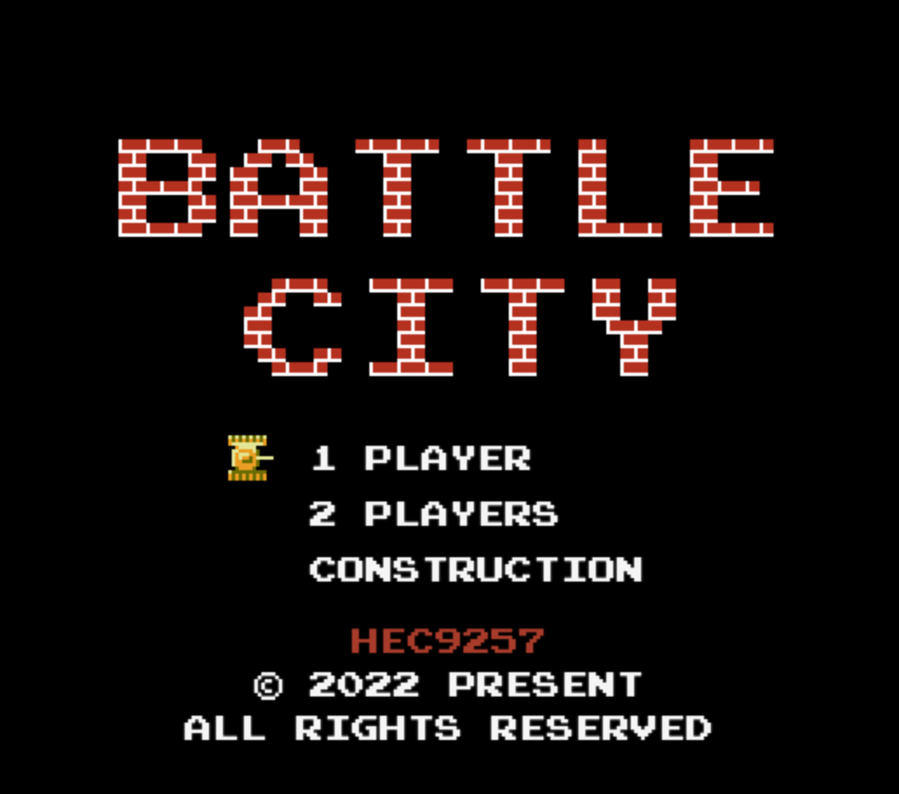

<div style="text-align:center;" align="center">

# Battle City

<!-- https://shields.io/ -->


</div>

[Battle city](https://github.com/hec9527/BattleCity)是经典的红白机游戏之一，其操作简单，玩法经典，经久不衰。本项目使用 `h5` + `ts` + `canvas` 原滋原味的复刻了红白机的游戏逻辑和流程。项目包含多个分支对应不同时期的历史版本。~~同时配有有非常完善的开发文档及日志~~，梳理实现思路和优化方向，~~所有的代码经过严格的测试~~

vite + ts + canvas + Web Audio音效合成

## 游戏特色

游戏还原度超过90%，同时兼容PC和移动端，随时随地即可享受经典中的经典

## 在线食用

[http://tank.hec9527.top/](http://tank.hec9527.top/)

## 本地享用

```zsh
git clone https://github.com/hec9527/BattleCity.git

cd BattleCity

pnpm install

npm run dev
```

## 奖励规则

TODO: 支持游戏设置，可以配置敌方是否可以获得奖励，以及其他配置 

| 奖励       | 友军效果                                                                         | 敌方效果                                     |
| ---------- | -------------------------------------------------------------------------------- | -------------------------------------------- |
| 五角星     | 默认1星，2星增加子弹速度和射速，4星可破坏铁块，6星清除森林，4颗以上中弹降低到2星 | 全图敌军增加子弹速度和射速                   |
| 坦克       | 获取玩家增加1生命                                                                | 全图敌军变为红书带奖励                       |
| 钢盔       | 获取玩家获取防护                                                                 | 全图敌军变为绿色装甲坦克 or 当前坦克获取防护 |
| 手枪       | 获取玩家变为4星                                                                  | 当前敌军获得击穿铁块能力，相当于玩家4星      |
| 铁锹       | 基地获得铁质围墙                                                                 | 玩家基地围墙消失                             |
| 地雷       | 所有敌方坦克全部禁锢，不能移动和开炮                                             | 玩家禁止移动，但是可以开炮                   |
| 炸弹       | 所有敌方坦克全部爆炸，带奖励的坦克不会生成奖励                                   | 没有保护罩的玩家全部炸毁                     |
| 船（暂无） | 可以通过河流，被攻击后失去船，不会受伤害                                         | 可以通过河流，被攻击后失去船，不会受伤害     |

> 其他奖励：每20,000分，玩家奖励1生命值

## Roadmap


- [x] 修复：地图编辑界面，生成多个河流时，河流的状态不统一
- [x] 修复：我方坦克出生后获得保护太长，应该适当缩短
- [x] 修复：奖励生成时应该避免生成在坦克附近
- [x] 特性：页面隐藏或者后台的时候，自动暂停游戏 (底层绘制采用requireAnimationFrame API，在页面后台时会自动停止绘制，但是游戏并没有暂停，回到页面会自动运行)
- [ ] 特性：增加更多敌方坦克类型（不同颜色）
- [x] 特性：高级子弹可以消灭草地
- [ ] 特性：新增竹筏，获得后可以过河
- [x] 特性：坦克在冰块上移动后会继续向前移动一小段
- [ ] 特性：游戏开始时可以选择是否允许敌方获得奖励，目前可以通过设定全局属性修改（`window.allowEnemyPick = false`）
- [ ] 特性：新增其它外设适配（手柄控制）
- [x] 流程：添加GAME OVER页面
- [x] 优化：移动端模拟器修改摇杆移动
- [ ] 其它：打包安卓应用，IOS应用（IOS需要开发者账号，且无法分发~弃）
- [x] 其它：增加`github action`自动打包发布
- [ ] 其它：记录历史最高分数，展示历史最高分数
- [x] 其它：修改音效合成，优化游戏音效
- [ ] 其它：增加联网功能，可以远程链接（这是一个大饼，不一定能做）

## 可以做哪些贡献

- 检查地图界面是否正确
- 游戏参数是否合理
- 游戏bug上报
- 建议&意见

## 游戏截图

[查看关卡截图][https://github.com/hec9527/BattleCity/tree/v2/images]



## 协议

[MIT](./LICENSE)